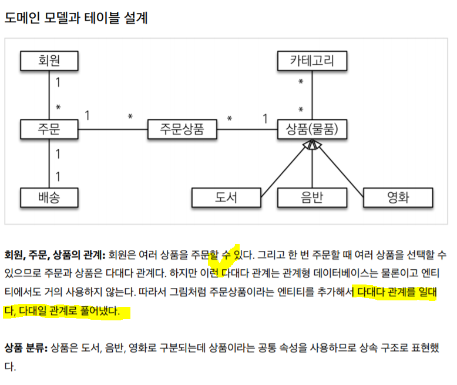

# Inflearn 을 통한 JPA 기본 및 응용 다지기
* 추석동안 인프런 강의 실습하기. (2020-09-28 ~ 2020-10-02)

## thymeleaf 수정 시, 매번 런타임 재수행해서 하기 귀찮으면?
```java
implementation 'org.springframework.boot:spring-boot-starter-devtools'
```
* 해당 구문을 삽입해주면, devtools 세팅이 된 상태에서 템플릿 수정 시 반영이 바로 된다.
* 우선 해당 devtools 에 대한 의존성을 주입받고, 애플리케이션을 재실행한다.

<BR>

```java
2020-09-29 00:57:02.913  INFO 9912 --- [  restartedMain] e.p.s.i.InflearnJpaBasisApplication      : Starting InflearnJpaBasisApplication on DESKTOP-PARK with PID 9912 (D:\doubler\dev\pasudo123-workspace\inflearn-jpa-basis\build\classes\java\main started by PASUDO in D:\doubler\dev\pasudo123-workspace\inflearn-jpa-basis)
2020-09-29 00:57:02.916  INFO 9912 --- [  restartedMain] e.p.s.i.InflearnJpaBasisApplication      : No active profile set, falling back to default profiles: default
2020-09-29 00:57:03.086  INFO 9912 --- [  restartedMain] .e.DevToolsPropertyDefaultsPostProcessor : Devtools property defaults active! Set 'spring.devtools.add-properties' to 'false' to disable
2020-09-29 00:57:03.087  INFO 9912 --- [  restartedMain] .e.DevToolsPropertyDefaultsPostProcessor : For additional web related logging consider setting the 'logging.level.web' property to 'DEBUG'
```
* 재 실행시, __restartedMain__ 이라는 문구가 나타남을 확인할 수 있다.
* `build > Recompile {file-name}` 문구를 클릭하거나 또는 ctrl + shift + f9 를 눌러준다.

<BR>

## H2 Database 설치는 어떻게 ?
* h2 database 공식 사이트 접속 및 windows 기준 install .exe 파일 설치
* 데이터 베이스 파일 상생
    * `jdbc:h2:~/jpashop` : 최초 1회만 접속하면 파일이 생성
    * `~/jpashop.mv.db` : 파일 생성 확인 (C:/{users}/{user-name} 하위에 존재)
    * `jdbc:h2:tcp://localhost/~/jpashop` 로 지속적인 접근을 수행

<BR>

## 로그에 쿼리 파라미터 작성은 어떻게?
```java
logging:
  level:
    org.hibernate.SQL: debug
    # 쿼리 파라미터 내용 출력
    org.hibernate.type: trace
```

```java
@Test
@Transactional
@DisplayName("테스트를 수행한다.")
@Commit
public void memberRepoTest() {
    // given
    Member member = new Member();
    member.setUsername("PARK SUNG DONG");

    // when
    long saveId = memberRepository.save(member);
    Member findMember = memberRepository.findById(saveId);

    // then
    assertThat(findMember.getId()).isSameAs(saveId);
}

// basicBinder 내용이 나타남.
2020-09-29 18:46:28.313 DEBUG 13424 --- [           main] org.hibernate.SQL                        : 
    insert 
    into
        member
        (username, id) 
    values
        (?, ?)
2020-09-29 18:46:28.316 TRACE 13424 --- [           main] o.h.type.descriptor.sql.BasicBinder      : binding parameter [1] as [VARCHAR] - [PARK SUNG DONG]
2020-09-29 18:46:28.317 TRACE 13424 --- [           main] o.h.type.descriptor.sql.BasicBinder      : binding parameter [2] as [BIGINT] - [1]
```

* 추가적으로 `p6spy` lib 의존성을 추가해주면, `?` 에 파라미터가 무엇인지 확인할 수 있다.
    * [링크](https://github.com/gavlyukovskiy/spring-boot-data-source-decorator)
    
```java
2020-09-29 18:53:34.086  INFO 6004 --- [    Test worker] p6spy                                    : #1601373214086 | took 0ms | statement | connection 3| url jdbc:h2:tcp://localhost/~/jpashop
insert into member (username, id) values (?, ?)
insert into member (username, id) values ('PARK SUNG DONG', 1);
2020-09-29 18:53:34.092  INFO 6004 --- [    Test worker] p6spy                                    : #1601373214092 | took 0ms | commit | co
```

<BR>

## 도메인 모델 및 테이블 설계


<BR>

## H2 를 설치하고 실행시킨 상태에서 스프링부트를 실행

<BR>

## 값 타입은 불변하게 만든다.
```java
/**
 * 내장타입 설정
 * 불변하게 만든다.
 */
@Embeddable
@Getter
@NoArgsConstructor(access = AccessLevel.PROTECTED)
public class Address {

    private String city;
    private String street;
    private String zipcode;

    public Address(final String city, final String street, final String zipcode) {
        this.city = city;
        this.street = street;
        this.zipcode = zipcode;
    }
}
```

<BR>

## JPA 엔티티 내의 컬렉션은 필드에서 추가하기
```java
@OneToMany(mappedBy = "order", fetch = FetchType.LAZY)
private List<OrderItem> orderItems = new ArrayList<>();
```

<BR>

## 테이블, 컬러명 생성 전략
* SpringPhysicalNamingStrategy
    * 카멜 케이스 --> 언더스코어(memberPoint member_point)
    * .(점) --> _(언더스코어)
    * 대문자 --> 소문자
    
## 연관관계 편의 메소드
* 양방향 연관관계 시, 특정 엔티티를 세팅하는 경우 양 쪽 엔티티에 값을 삽입한다.
* 연관관계 편의 메소드의 위치는 비즈니스 로직에 따라서 주체가 되는 엔티티가 가지도록 한다.
```java
// 연관관계 편의메소드
public void setMember(Member member) {
    this.member = member;
    member.getOrders().add(this);
}

public void addOrderItem(OrderItem orderItem) {
    this.orderItems.add(orderItem);
    orderItem.setOrder(this);
}

public void setDelivery(Delivery delivery) {
    this.delivery = delivery;
    delivery.setOrder(this);
}
``` 

## 참고자료
* [thymeleaf](https://www.thymeleaf.org/)